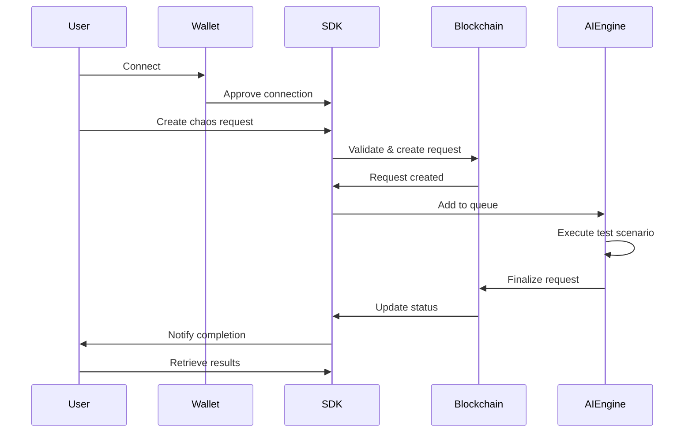

# Glitch Gremlin AI Workflow

## End-to-End User Workflow

### 1. Wallet Connection
- User connects Solana wallet (Phantom, Solflare, etc.)
- SDK verifies wallet connection and balance
- User approves token allowance for Glitch Gremlin operations

### 2. Chaos Request Creation
1. User selects test parameters:
   - Target program address
   - Test type (Fuzz, Load, Exploit, Concurrency)
   - Duration (60-3600 seconds)
   - Intensity (1-10 scale)
2. SDK validates parameters
3. User approves token transfer for test fee
4. On-chain:
   - ChaosRequest account created
   - Tokens escrowed
   - Request marked as Pending

### 3. Off-Chain Processing
1. AI Engine picks up request from queue
2. Spins up test environment:
   - Local test validator
   - Forked mainnet environment
   - Containerized malicious traffic simulation
3. Executes test scenario based on parameters
4. Records metrics:
   - Transaction throughput
   - CPU usage
   - Error logs
   - Discovered vulnerabilities

### 4. Result Finalization
1. AI Engine signs proof of completion
2. On-chain:
   - ChaosRequest status updated
   - Tokens released/refunded
   - Results reference stored (IPFS/Arweave)
3. Off-chain:
   - Detailed logs stored
   - Metrics analyzed
   - Vulnerability report generated

### 5. User Notification
1. SDK monitors request status
2. User receives notification when complete
3. Results available through:
   - SDK methods
   - CLI tools
   - Web interface

## Workflow Diagram

## Key Considerations

### Rate Limiting
- Max 10 requests per minute per user
- Minimum 2 seconds between requests
- Max 1M tokens escrowed per request

### Security
- Multisig control for critical operations
- Signed proofs from AI engine
- Comprehensive error handling

### Monitoring
- Real-time status updates
- Detailed test metrics
- Vulnerability reports
